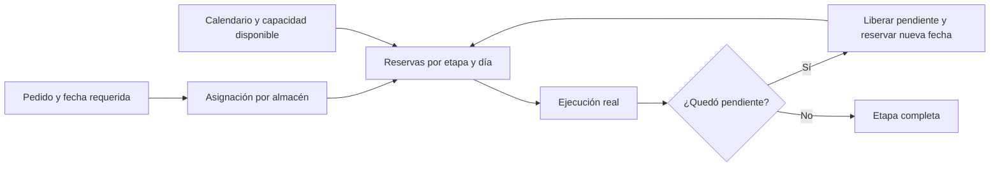

# Planeación por capacidad diaria

La demanda conserva su identidad aunque se atienda en varias fechas. Una asignación determina qué almacén surtirá la cantidad; las reservas de capacidad reparten ese trabajo en días y etapas. Reprogramar cambia el plan, no la cantidad pedida ni la fecha original requerida.

| Tabla | Responsabilidad |
| --- | --- |
| planning.CapacityPool | Capacidad agregada de un almacén y etapa: picking, packing o carga. |
| planning.CapacityDay | Calendario, horario UTC, capacidad normal, extra y no disponible por día local. |
| planning.WorkStandardVersion | Consumo estándar por pieza/producto, con versiones para no alterar planes anteriores. |
| planning.CapacityBooking | Cantidad reservada para una asignación, etapa y fecha; conserva el vínculo con una reserva reprogramada. |
| planning.CapacityExecution | Evidencia del trabajo real vinculada al picking, packing o evento de carga. |

## Ejemplos

- 1,000 piezas y 600 por día: 600 el primer día y 400 el segundo.
- 5,000 piezas y 600 por día: **9 días laborables**, ocho de 600 y uno de 200.
- Si al cierre semanal se embarcaron 4,000 de 5,000, quedan 1,000 en el pedido original. Se proponen nuevas fechas según capacidad libre, prioridades y disponibilidad. Con cinco días de 600, la capacidad semanal sería 3,000; llegar a 4,000 requiere otro calendario o capacidad adicional.
- La capacidad no utilizada no se acumula: dejar 200 libres hoy no aumenta automáticamente el límite de mañana.
- Si 4,000 fueron recogidas pero no embarcadas, el pendiente de picking difiere del pendiente de embarque. No se suman avances de distintas etapas como si fueran entregas.

## Reglas del próximo servicio de planeación

Capacidad efectiva del día = normal + extra aprobada − no disponible. Días no laborables se registran con cero; un día sin registro significa falta de configuración. La reserva debe comprobar la capacidad compartida por TODOS los pedidos, bajo bloqueo/transacción, no por pedido individual.

BASE_QUANTITY se usa con productos comparables y una misma unidad (factor uno). STANDARD_MINUTES usa tiempos estándar versionados para productos con esfuerzos distintos. Los minutos estándar no son un reloj de productividad real. No duplicar disponibilidad si el mismo personal/equipo cubre varias etapas; validar este supuesto antes del piloto.

Para reprogramar: calcular lo pendiente, liberar esa parte de la reserva anterior y crear la nueva reserva en una misma transacción. Mantener la ejecución ya realizada, motivo, usuario, referencia anterior y fecha requerida original. Nunca copiar el pedido completo ni cambiar su vencimiento para ocultar un atraso.

La demanda y cada asignación se cuentan una sola vez por etapa. Reservas canceladas liberan únicamente su parte no ejecutada. Una reversa de material no devuelve automáticamente el tiempo ya gastado; los retrabajos requieren tratamiento explícito.

La ocupación combina trabajo ejecutado y trabajo pendiente reservado, evitando contar dos veces lo mismo. Los excesos reales se conservan y generan excepción; no se borran para hacer coincidir el plan.

Capacidad de surtido no equivale a existencia física, capacidad de transporte ni promesa de entrega. Esas comprobaciones y la aprobación de fechas deben hacerse juntas en el backend.

## Estado de implementación

Las cinco tablas, relaciones e integridad por registro ya están en las migraciones SQL. El motor que calcula disponibilidad, evita sobreasignaciones concurrentes y reprograma pendientes aún debe implementarse y probarse. No se crea una promesa de entrega automática por instalar la base.
