# Diagramas de relaciones

Versión 0.2 · 27 de septiembre de 2026. Propuesta lógica, pendiente de validación del negocio. El [diccionario completo](../../database/schema/diccionario-tablas.md) contiene todos los campos, obligatoriedad y claves. En estos diagramas se muestran PK y FKs; los límites mínimos de participación (por ejemplo, pedido liberado con líneas) también requieren reglas transaccionales.

## Recorrido de cantidades

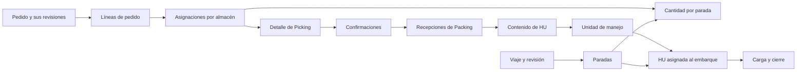

## security

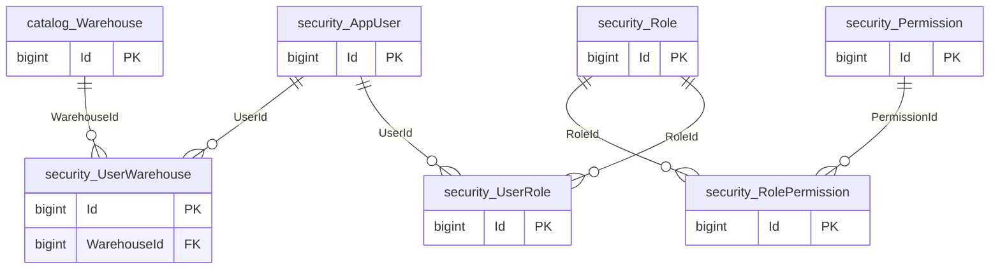

## platform

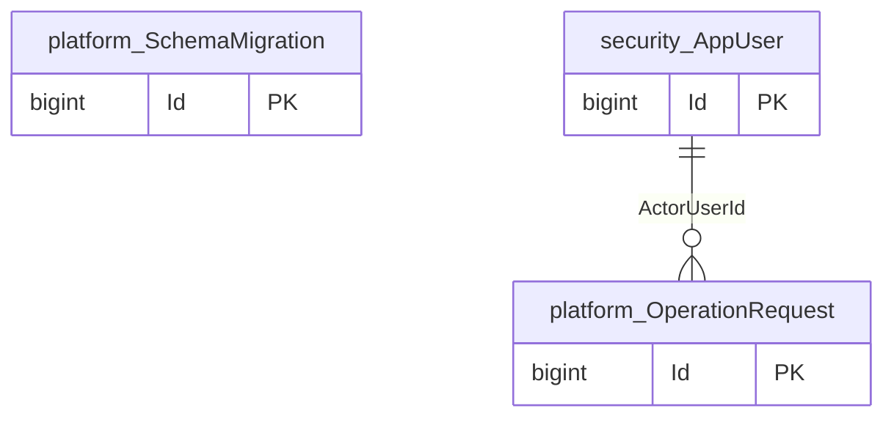

## catalog

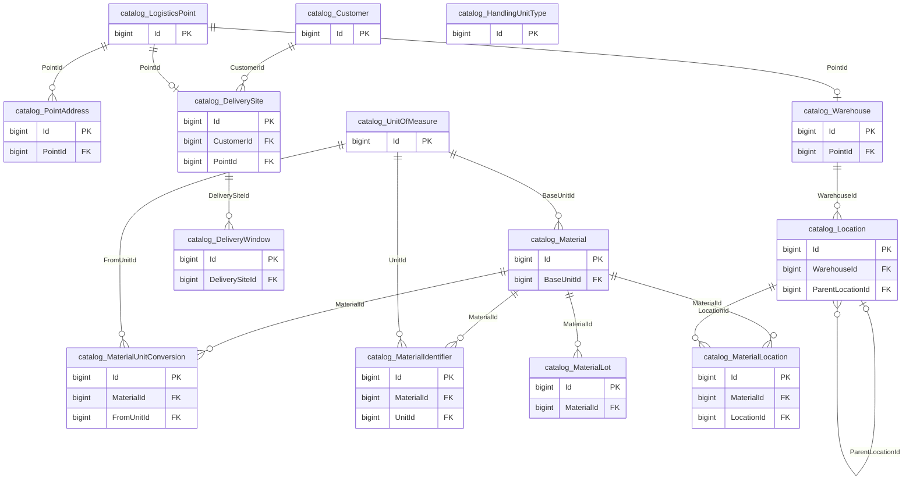

## integration

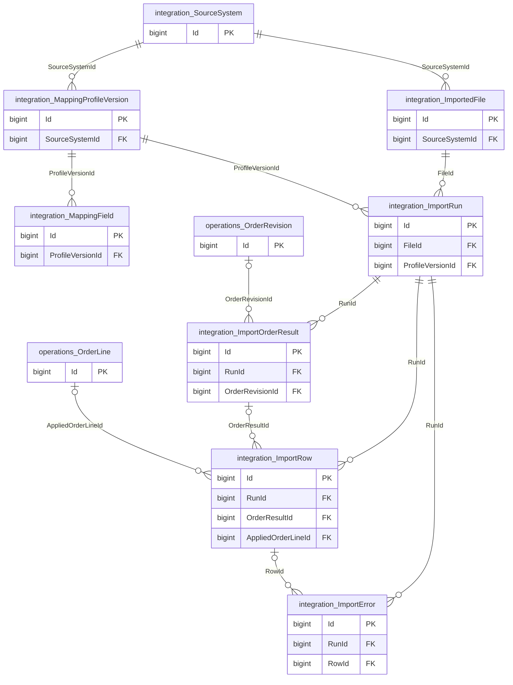

## operations

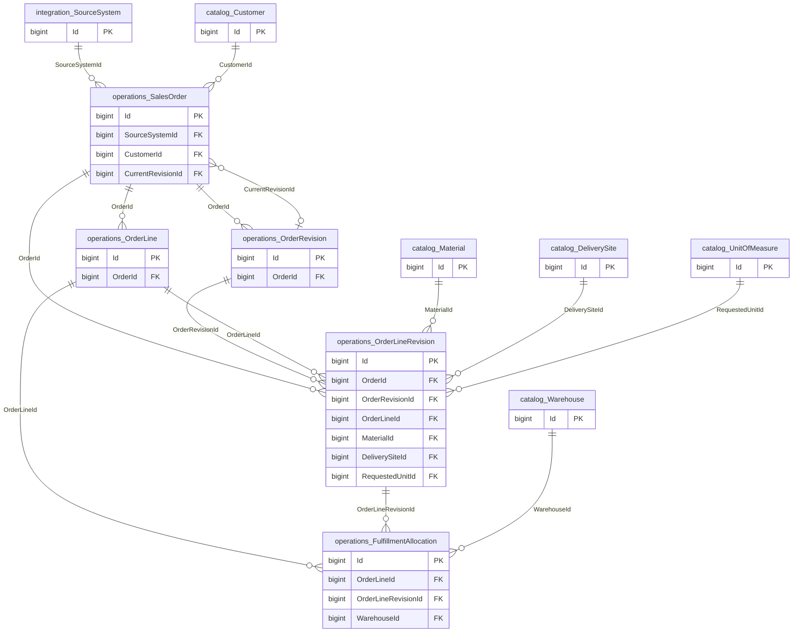

## planning

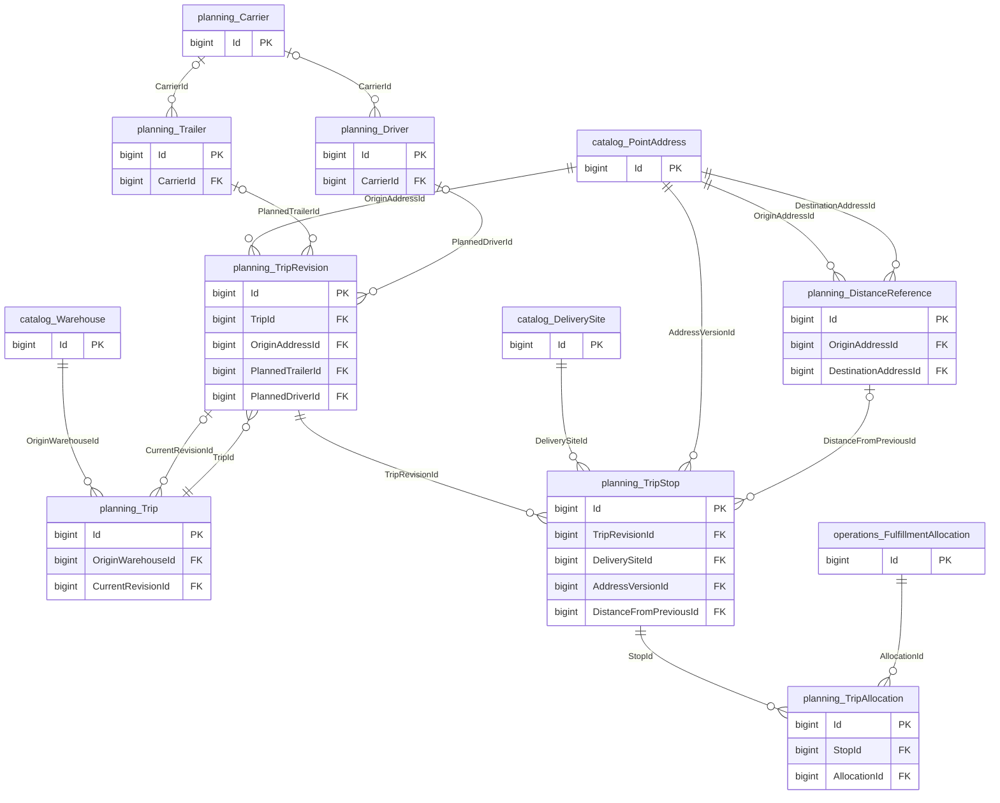

## warehouse

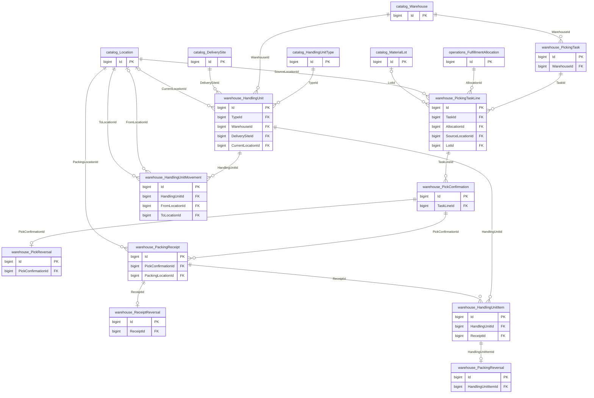

## shipping

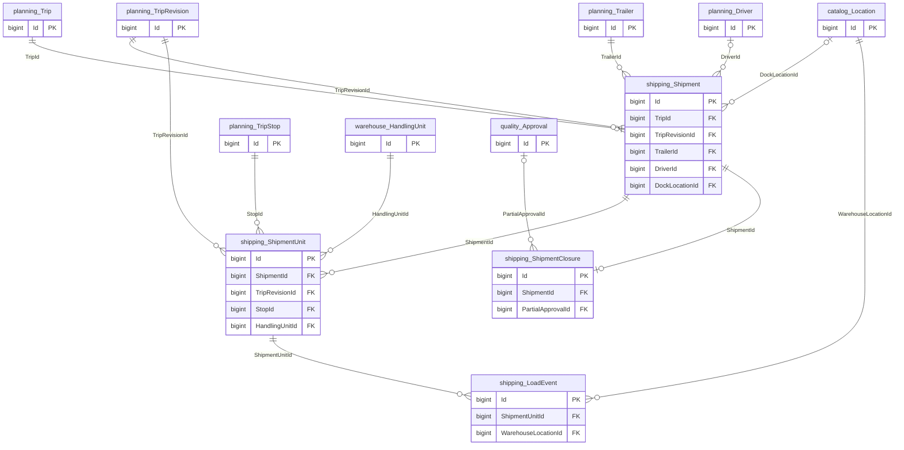

## quality

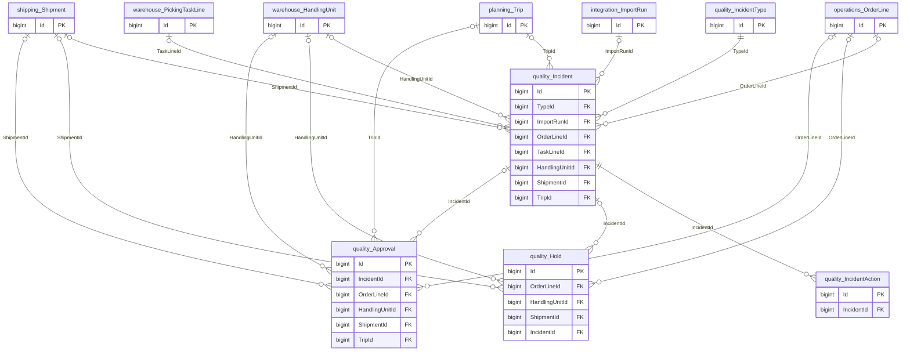

## audit

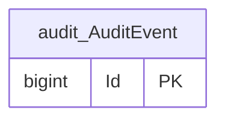

Las relaciones a usuarios y comandos se omiten en módulos operativos para facilitar la lectura; están completas en DBML y en el diccionario. La cardinalidad muchos del gráfico permite historia; las claves únicas y filtros del diccionario restringen relaciones específicas a uno vigente.

Actualización 0.2: las tablas de capacidad diaria complementan este diseño; consultar [capacidad diaria](../../database/schema/capacidad-diaria.md). La implementación inicial SQL está en database/migrations; las reglas agregadas de operación siguen pendientes en el backend.

## Capacidad diaria — ampliación 0.2

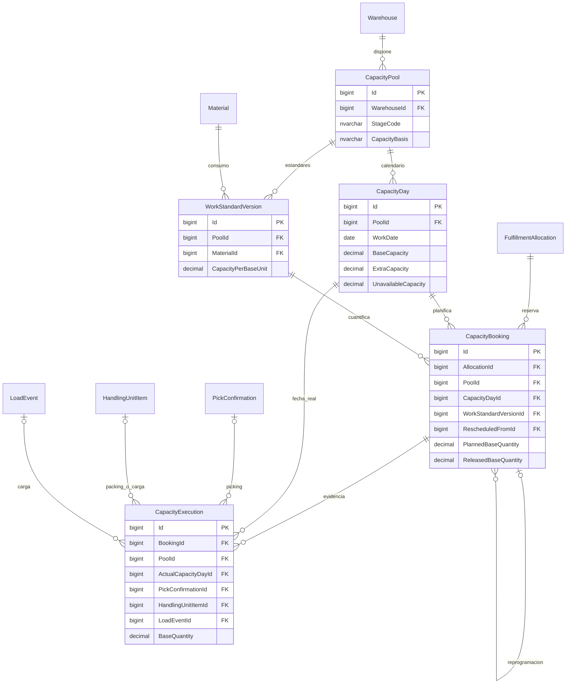

Las relaciones compuestas conservan el mismo PoolId en día, estándar, reserva y ejecución.
En ejecución se exige picking solo, contenido de HU solo, o contenido de HU junto con evento de carga.
