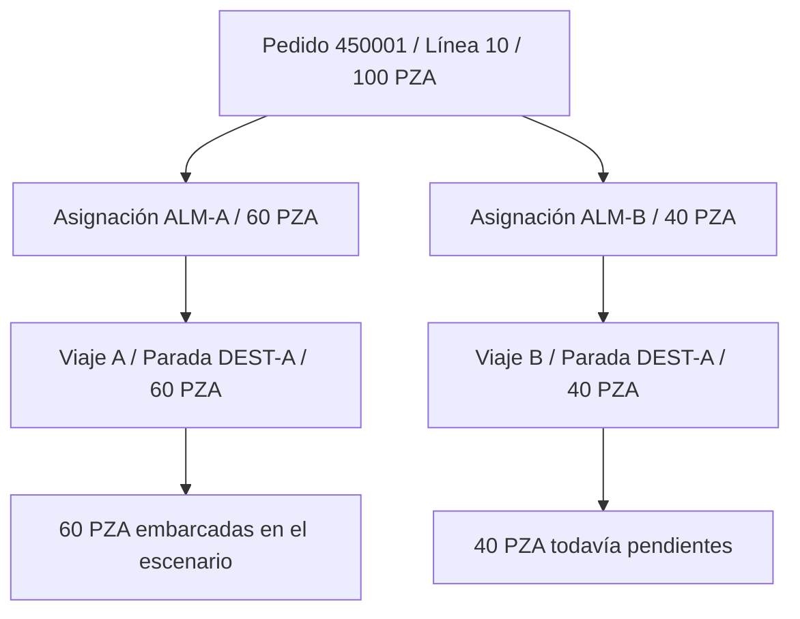

# Cómo funciona el modelo con datos de prueba

Estado: demostración ficticia del diseño. No se ha creado ni llenado SQL Server.

## La idea en palabras simples

La información se guarda por temas y se relaciona mediante identificadores. El pedido dice qué se necesita; la planeación decide desde dónde y en qué viaje se surtirá; las confirmaciones registran qué se hizo.

Un mismo dato no se copia manualmente en todas las etapas. El contenido de una HU apunta a la recepción de Packing; esa recepción apunta a una confirmación de Picking; esta apunta a la línea del pedido. Así se puede recorrer el camino en ambos sentidos.

En los archivos de ejemplo usamos códigos legibles. En SQL se resolverán a las PK/FK internas del [esquema](../../database/schema/esquema-logico.md).

## El pedido principal

El archivo contiene el pedido **450001** del Cliente ficticio A:

| Línea | Material | Solicitado | Destino |
| --- | --- | --- | --- |
| 10 | MAT-001, soporte | 100 PZA | DEST-A |
| 20 | MAT-002, tornillo | 20 PZA | DEST-A |

También incluye 80 PZA de MAT-002 para Cliente B y 50 PZA de MAT-003 para Cliente C, en otros pedidos.

## Paso a paso

| Paso | Qué pasa en el ejemplo | Tablas principales |
| --- | --- | --- |
| 1. Configuración | Registrar los dos almacenes, ubicaciones, tres clientes, destinos y materiales. | Warehouse, Location, Customer, DeliverySite, Material |
| 2. Entrada | Recibir el archivo y revisar datos antes de crear pedidos. | ImportedFile, ImportRun, ImportRow, ImportError |
| 3. Pedido | Registrar identidad de pedido/línea y conservar revisión aceptada. | SalesOrder, OrderLine, OrderRevision, OrderLineRevision |
| 4. Surtido | Dividir las 100 piezas: 60 desde ALM-A y 40 desde ALM-B. | FulfillmentAllocation |
| 5. Viaje | ALM-A atiende A, B y C; ALM-B tiene un segundo viaje a A. | Trip, TripRevision, TripStop, TripAllocation |
| 6. Picking | Confirmar las cantidades recogidas en ALM-A. Las 40 de ALM-B siguen pendientes. | PickingTask, PickingTaskLine, PickConfirmation |
| 7. Packing | Recibir lo recogido y formar tres HU según destino. | PackingReceipt, HandlingUnit, HandlingUnitItem |
| 8. Preembarque y carga | Mover a espera y cargar C, B, A para descargar A, B, C. | HandlingUnitMovement, ShipmentUnit, LoadEvent |
| 9. Cierre | Registrar lo cargado y conservar el manifiesto. | Shipment, ShipmentClosure, AuditEvent |

El escenario simplificado muestra el resultado esperado, no todos los eventos intermedios de estas tablas.

La ubicación de un material no demuestra su existencia física. El ejemplo no activa ni inventa un saldo de inventario.

## Relaciones del pedido de 100 piezas

El pedido principal también tiene su línea de 20 tornillos. Estará completamente surtido/embarcado cuando todas sus líneas cumplan sus cantidades, no por el solo hecho de cerrar un viaje.

## Primer viaje y unidades de manejo

| HU | Contenido | Destino | Orden de entrega | Orden de carga |
| --- | --- | --- | --- | --- |
| HU-DEMO-A | 60 soportes + 20 tornillos | DEST-A | 1 | 3 |
| HU-DEMO-B | 80 tornillos | DEST-B | 2 | 2 |
| HU-DEMO-C | 50 ensambles | DEST-C | 3 | 1 |

La HU A combina dos materiales del mismo destino y almacén, conforme a la regla propuesta. En el escenario completo está embarcada y no se puede modificar.

Distancias inventadas del primer viaje: ALM-A a DEST-A 15 km, DEST-A a DEST-B 25 km y DEST-B a DEST-C 20 km. Son tramos entre puntos, no tres distancias sumadas desde el almacén. No hay optimización ni GPS.

## Resultado después del primer viaje

| Pedido / línea | Solicitado | Picking | Packing | Embarcado | Pendiente de embarcar |
| --- | --- | --- | --- | --- | --- |
| 450001 / 10 | 100 | 60 | 60 | 60 | 40 |
| 450001 / 20 | 20 | 20 | 20 | 20 | 0 |
| 450002 / 10 | 80 | 80 | 80 | 80 | 0 |
| 450003 / 10 | 50 | 50 | 50 | 50 | 0 |

Todas las cantidades de esta tabla están en PZA. “Embarcado” significa salida del almacén; no confirma entrega al cliente.

## Cómo revisarlo entre dos personas ahora

1. Abrir [pedidos_correctos.csv](../../samples/csv/pedidos_correctos.csv).
2. Una persona sigue el pedido 450001 en [demo_logistica.json](../../samples/scenarios/demo_logistica.json).
3. La otra revisa asignaciones, HU y viajes usando los códigos relacionados.
4. Ejecutar el comando del [README de muestras](../../samples/README.md).
5. Comparar el avance calculado con la tabla anterior.
6. Revisar los archivos con errores intencionales y el motivo esperado.

Es posible ejecutar el validador las veces necesarias: no modifica las muestras ni accede a SQL.

## Pruebas operativas que haremos después

- Repetir una confirmación con la misma clave: devolver el resultado original sin aumentar cantidad.
- Confirmar otra pieza sobre las 60 ya completadas de la asignación ALM-A: rechazar exceso.
- Cargar la misma HU en dos embarques: rechazar doble asignación.
- Asignar una HU de A a una parada de B: rechazar destino.
- Confirmar desde dos computadoras simultáneamente: conservar el límite de cantidad.
- Completar las 40 piezas de ALM-B mediante los servicios: el pendiente de la línea baja a cero.
- Interrumpir la conexión después del commit: consultar/reintentar sin duplicar.

Estas acciones no se ejecutaron contra una aplicación porque los módulos aún no existen.

## Siguiente incremento para pruebas reales

Implementar una base de desarrollo separada, inicializador y primera migración pequeña; comenzar por catálogos, pedidos e importación. Después incorporar planeación y ejecución por etapas.

Las pruebas de carga de datos deben ser repetibles, reconocer su versión y no borrar datos ajenos. Cada desarrollador usará su propia base. El cargador de ejemplos y las credenciales no forman parte de la operación normal del cliente.
